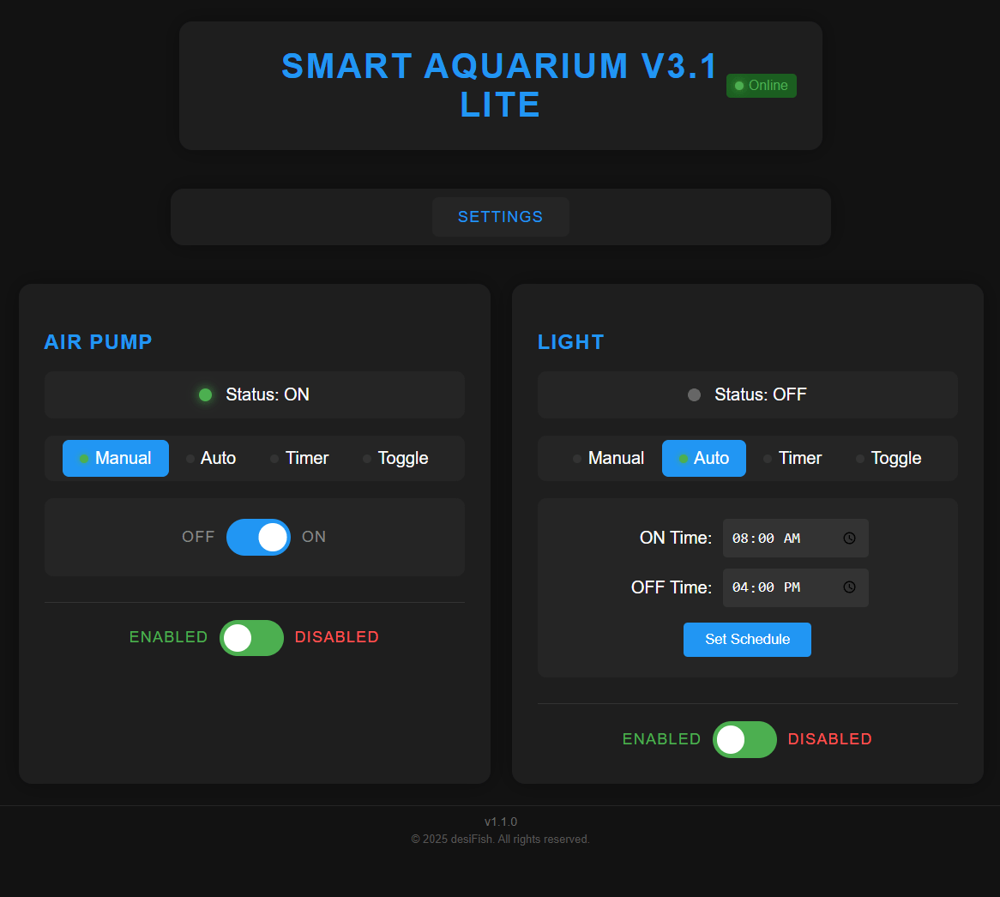
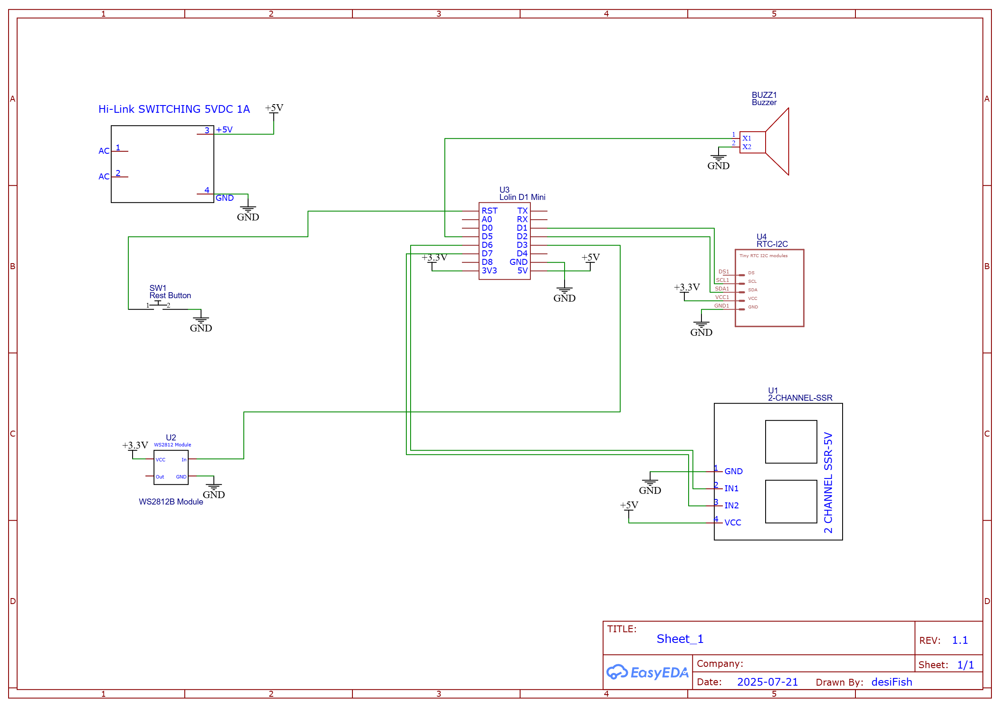

# Smart Aquarium V3.1 Lite 🐟

> 📢 **Project Inspiration & Update**: This project was inspired by Project MINA, also known as [Smart Aquarium V4.0](https://github.com/desiFish/Smart-Aquarium-V4.0). The V4.0 project is currently on hold due to hardware unavailability, but will be completed in the near future. Even in its current state, V4.0 is stable and working—do try it out and give your feedback! 🚀

> 📢 **Looking for a heavier version?** Check out [Smart Aquarium V3.1](https://github.com/desiFish/Smart-Aquarium-V3.1) - A scaled up 4-relay version of this project!

[](https://github.com/desiFish/Smart-Aquarium-V3.1-Lite/releases)
[](https://github.com/desiFish/Smart-Aquarium-V3.1-Lite/issues)
[](https://github.com/desiFish/Smart-Aquarium-V3.1-Lite/stargazers)
[](https://www.gnu.org/licenses/gpl-3.0)
[](https://www.espressif.com/en/products/socs/esp8266)
[](https://www.arduino.cc/)
[](https://github.com/desiFish/Smart-Aquarium-V3.1-Lite/wiki)

An advanced, ESP8266-based interactive aquarium control system with a modern web interface for managing multiple relays, timers, and schedules.

> © 2025 desiFish. This project is protected by copyright law. All rights reserved unless explicitly stated under the GPL v3 license terms.

## Index

- [Safety Disclaimer ⚠️](#safety-disclaimer-️)
- [Beep Codes Reference Table 🔔](#-beep-codes-reference-table)
- [LED Color Codes & Status Indications 💡](#-led-color-codes--status-indications)
- [Errors & Alerts via Web Interface �️](#️-errors--alerts-via-web-interface)
- [Gallery 📸](#gallery-)
- [RTC Support (DS1307/DS3231) 🕒](#rtc-support-ds1307ds3231-)
- [Features 🌟](#features-)
- [Scalability 🔄](#scalability-)
- [Hardware Requirements 🔧](#hardware-requirements-)
- [Dependencies 📦](#dependencies-)
- [NTP Time Offset and Server Selection 🕒](#ntp-time-offset-and-server-selection-)
- [Installation 🚀](#installation-)
- [Backup and Restore 🗄️](#backup-and-restore-️)
- [Important Troubleshooting ⚠️](#important-troubleshooting-)
- [Web Interface 🌐](#web-interface-)
- [API Endpoints 🔌](#api-endpoints-)
- [Contributing 🎯](#contributing-)
- [License 📜](#license-)
- [Acknowledgments 🙏](#acknowledgments-)

## Safety Disclaimer ⚠️

**WARNING: This project involves working with HIGH VOLTAGE (220V AC) electrical systems which can be LETHAL.**

By using this project, you acknowledge and agree to the following:

1. **Inherent Risks**: Working with electrical systems, particularly those involving mains voltage (220V AC), carries inherent risks including but not limited to:
   - Electric shock
   - Fire hazards
   - Equipment damage
   - Serious injury or death

2. **Liability Waiver**: The creator(s) and contributor(s) of this project:
   - Accept NO LIABILITY for any damage, injury, or death resulting from the use of this project
   - Make NO WARRANTIES or guarantees about the safety or functionality of this project
   - Are NOT responsible for any improper implementation or modifications

3. **Required Precautions**:
   - Installation MUST be performed by a qualified electrician
   - ALL local electrical codes and regulations MUST be followed
   - Proper isolation and safety measures MUST be implemented
   - Regular safety inspections are MANDATORY

**USE THIS PROJECT AT YOUR OWN RISK**

## 🔔 Beep Codes Reference Table

| Error Condition                      | Beep Code         | Description           |
|--------------------------------------|-------------------|-----------------------|
| Filesystem mount failed              | 3 short beeps     | beep(100, 3, 200)     |
| Failed to create /config directory   | 2 long beeps      | beep(300, 2, 300)     |
| RTC not found                        | 1 short beep      | beep(100, 1, 0)       |


Refer to the beep codes above for troubleshooting during device startup. Each error condition triggers a distinct beep pattern for easy identification.

## 💡 LED Color Codes & Status Indications

The onboard RGB LED provides visual feedback for key system states and errors:

| Operation / Error Condition         | LED Color / Pattern         | Description                                  |
|-------------------------------------|-----------------------------|----------------------------------------------|
| Normal operation (idle/ready)       | Green flash (every 2s)      | System running normally                      |
| WiFi connecting                     | White blink                 | Attempting WiFi connection                   |
| WiFi/AP mode active                 | Blue                        | Device in AP mode for setup                  |
| Filesystem/Config/RTC error         | Solid Red                   | Critical error (see beep codes above)        |
| OTA update started                  | Bright Red                  | OTA update in progress (start)               |
| OTA update progress                 | Blue blink                  | OTA update progress (alternating blue/black) |
| OTA update finished (success)       | White                       | OTA update completed successfully            |
| OTA update finished (error)         | Red                         | OTA update failed                            |
| Graceful reboot (via API)           | Deep Yellow (100)           | Device is rebooting after API call           |

These LED patterns help you quickly identify the system status and troubleshoot issues. For details on each color and pattern, refer to the firmware code comments.

## �️ Errors & Alerts via Web Interface

In addition to audible beep codes and LED color indications, the Smart Aquarium V3.1 system provides error and alert notifications directly through the web interface:

- **Error Messages:** Critical errors (such as RTC failure, filesystem issues, or configuration problems) are displayed as alerts or status messages on the web dashboard and settings page.
- **API Endpoint:** The `/api/error` endpoint returns the latest error message, which is cleared after being read. This allows the web UI to fetch and display real-time error information.
- **RTC Status:** If the RTC is not connected or there is a time sync issue, the settings page will show `RTC_ERROR` or a warning notification.
- **Browser Notifications:** The web interface automatically notifies you if the RTC time is not synchronized, or if there are configuration issues requiring attention.
- **Status Indicators:** Relay status, WiFi connection, and system health are shown live on the dashboard, with alerts for any abnormal conditions.

These web-based alerts and error messages help you quickly identify and resolve issues, even if you miss the initial beep or LED indication. For troubleshooting, always check the web interface for the latest system status and error details.

## Gallery 📸

|  <br><em>Main Dashboard - Desktop View</em> |  <br><em>Settings Page - Desktop View</em> |
|:--:|:--:|
|  <br><em>Hardware Info Page - Desktop View</em> |  <br><em>Main Dashboard - Mobile View</em> |
|  <br><em>Settings Page - Mobile View</em> |  <br><em>Hardware Info Page - Mobile View</em> |
|  <br><em>Inside</em> |  <br><em>Inside-Close</em> |
|  <br><em>Inside with all parts</em> |  <br><em>Outside</em> |
|  <br><em>Status LED</em> |  |

<div style="margin: 20px 0; padding: 10px; border-left: 4px solid orange; background: #fffbe6; color: #b36b00; font-size: 1.05em;">
<strong>Note:</strong> My soldering work shown in the images is very congested due to last moment changes and additions. I know what I'm doing and have taken proper precautions.<br>
<strong>Please do not replicate this for your own project.</strong> Use a bigger PCB or Vero Board and ensure proper safety and spacing for all components.
</div>

## RTC Support (DS1307/DS3231) 🕒

This project supports both **DS1307** and **DS3231** RTC modules for accurate timekeeping.  
- By default, the code uses DS1307.  
- To use DS3231, uncomment the relevant line in the code (`RTC_DS3231 rtc;`) and comment out the DS1307 line before uploading.
- Both modules connect via I2C (SDA/SCL) to the ESP8266.
- RTC time can be updated from the **Settings** page in the web interface.

> **Note:** The RTC keeps time even when the ESP8266 is powered off. Time synchronization from NTP is only required after initial setup or if the RTC loses power.

## Features 🌟

- **🎛️ Multiple Control Modes**
  - Manual Toggle Control
  - Automatic Scheduling
  - Timer-based Operation
  - Toggle Mode with On/Off intervals

- **⚡ Real-time Controls**
  - 2 Independent Relay Channels
  - Individual Relay Naming
  - Status Monitoring
  - Connection Status Indicator

- **⏰ Time Management**
  - NTP Time Synchronization (manual update via Settings page)
  - Uses pool.ntp.org servers for time sync
  - Automatic Time Updates with fallback servers
  - Time Accuracy depends on RTC module (DS1307/DS3231)
  - Persistent Scheduling
  - Requires WiFi connection for NTP sync
  > 📝 **Note**: This version relies on RTC for time management. Time can be updated from NTP manually via the Settings page. For offline operation or exact timing, DS3231 is recommended for higher accuracy.

- **🎨 Modern UI**
  - Responsive Design
  - Dark Theme
  - Touch-friendly Interface
  - Real-time Status Updates

- **🛠️ System Features**
  - OTA (Over-the-Air) Updates
  - LittleFS File System
  - Persistent Configuration Storage
  - RESTful API Endpoints

## Scalability 🔄

This system is highly scalable and can be easily modified to control more or fewer relays:

1. **Hardware Scaling**
   - Simply adjust the number of relays and GPIO pins in the main program
   - Update pin definitions in the configuration section

2. **Interface Scaling**
   - Modify the relay count in the JavaScript array: `[1, 2]`
   - Add or remove corresponding div blocks in `index.html` and `settings.html`
   - The web interface automatically adapts to the number of configured relays

3. **Memory Considerations**
   - ESP8266 can theoretically handle up to 16 relays
   - Each relay requires approximately:
     - 2KB of program memory
     - 100 bytes of RAM for state management
     - Minimal impact on web interface size

> 💡 **Scaling Tip**: When modifying the number of relays, ensure you update all three components:
> 1. Hardware GPIO definitions
> 2. JavaScript relay array
> 3. HTML interface elements

## Hardware Requirements 🔧

- ESP8266 12-E NodeMCU Development Board (or any compatible ESP8266 module)
- 2-Channel Relay Module
- RTC Module: DS1307 (default) or DS3231 (select in code before uploading)
- Power Supply (5V)
- Stable WiFi Connection (2.4GHz network with internet access for NTP)
  > ⚠️ **Important**: RTC module is required for timekeeping. DS3231 is recommended for higher accuracy and reliability. Internet connectivity is only needed for time synchronization via NTP (manual update).

> 💡 **Compatibility**: This project is developed and tested on the ESP8266 12-E NodeMCU Kit.  
> It has been tested on **NodeMCU 1.0** and **LOLIN (Wemos) D1 R2 Mini** boards.  
> It works with other ESP8266-based boards with minimal changes. Ensure your board has enough GPIO pins for relays and I2C (SDA/SCL) for RTC.

### ESP8266 Pinout
<div align="center">
  
  <p><em>ESP8266 NodeMCU pinout diagram (Source: <a href="https://randomnerdtutorials.com">RandomNerdTutorials</a>)</em></p>
</div>

### Circuit Diagram


The above schematic shows the connections between the ESP8266 and relay module. Make sure to follow the pin connections exactly as shown for proper functionality.

## Dependencies 📦

> ⚠️ **Important**: The following specific libraries are required for compatibility. Using different versions may cause stability issues.

- ESP8266WiFi (Built-in with ESP8266 Arduino Core)
- [ESPAsyncTCP](https://github.com/ESP32Async/ESPAsyncTCP) - **Required Version**
- [ESPAsyncWebServer](https://github.com/ESP32Async/ESPAsyncWebServer) - **Required Version**
- LittleFS (Built-in with ESP8266 Arduino Core)
- ArduinoJson
- ElegantOTA
- NTPClient
- [Adafruit_NeoPixel](https://github.com/adafruit/Adafruit_NeoPixel) - **Required Latest Version**
- [RTClib](https://github.com/adafruit/RTClib) - **Required Latest Version**

All libraries can be installed through the Arduino Library Manager. These specific libraries are mandatory for proper functionality of the ElegantOTA system.

## NTP Time Offset and Server Selection 🕒

The code uses the following line to initialize the NTP client:
```cpp
NTPClient timeClient(ntpUDP, "in.pool.ntp.org", 19800);
```
- The third parameter, `19800`, is the time offset in **seconds** for your timezone.
- `19800` seconds = **5 hours 30 minutes** (5 × 3600 + 30 × 60), which is the offset for **Indian Standard Time (IST, UTC+5:30)**.
- If you are in a different timezone, calculate your offset in seconds and update this value accordingly.

**How to calculate your offset:**
- Offset (in seconds) = (Hours × 3600) + (Minutes × 60)
- Example for UTC+2: (2 × 3600) = `7200`

**Default NTP Server:**
- The default NTP server is set to `"in.pool.ntp.org"` (India).
- For best accuracy, select the NTP pool server nearest to your location from [https://www.ntppool.org/en/zone/in](https://www.ntppool.org/en/zone/in) or [https://www.ntppool.org/](https://www.ntppool.org/).

**To change:**
- Replace `"in.pool.ntp.org"` with your region's NTP pool server (e.g., `"europe.pool.ntp.org"`, `"us.pool.ntp.org"`, etc.).
- Adjust the offset to match your local timezone.

Example for Central European Time (CET, UTC+1):
```cpp
NTPClient timeClient(ntpUDP, "europe.pool.ntp.org", 3600);
```

## Installation 🚀

> **🛠️ CH340 Driver Troubleshooting**
>
> <span style="color:red; font-weight:bold;">Some ESP8266 modules use the CH340 USB-to-serial chip, which may occasionally cause upload problems.</span>
>
> If you encounter an error like:
>
> ```text
> lolin d1 mini A fatal esptool.py error occurred: Cannot configure port, something went wrong. Original message: PermissionError(13, 'A device attached to the system is not functioning.', None, 31)esptool.py ?v3.0 Serial port COM4
> ```
>
> **How to fix:**
>
> 1. Go to the `src` folder and locate `CH34x_Install_Windows_v3_4.zip`.
> 2. Unzip the file and run the installer.
> 3. Click the **Uninstall** button first.
> 4. After successful uninstallation, click the **Install** button.
> 5. Once installation is complete, try uploading your program again.
>
> <span style="color:orange; font-weight:bold;">This issue may occur randomly. If it happens again, simply repeat the above steps.</span>

1. Clone this repository:
   ```bash
   git clone https://github.com/desiFish/Smart-Aquarium-V3.1-Lite.git
   ```

2. Open the project in Arduino IDE

3. Install required libraries through Arduino Library Manager

4. Initial Setup (Wired Upload - One time only):
   - Connect ESP8266 to your computer via USB
   - Install "ESP8266 LittleFS Data Upload" tool in Arduino IDE ([Installation Guide](https://randomnerdtutorials.com/arduino-ide-2-install-esp8266-littlefs/))
   - Ensure the `data` folder contains `index.html`, `settings.html`, and `favicon.jpg` with exact folder structure
   - Upload HTML files using the guide above
   - Upload the code from Arduino IDE
   - After successful code upload, the device will create a WiFi access point (hotspot) named `Aquarium-Setup` with password `12345678`. Connect to this network using any device (preferably a PC). Ignore any alert about "connected with no internet." Open a browser and go to `192.168.4.1`. Navigate to the Settings page, enter your WiFi credentials, and click on "Save WiFi." The device will then reboot and attempt to connect to your configured network.

   **Dynamic vs Static IP:**
   - By default, the device uses **Dynamic IP (DHCP)**. This means your WiFi router will automatically assign an available IP address to the device. This is recommended for most users and ensures easy connectivity.
   - However, with Dynamic IP, the assigned address may change every time the device or router restarts. This can be inconvenient, as you may need to keep searching for the new IP address to access the device.
   - If you are not sure what to use for static IP, simply fill in your WiFi SSID and password, do NOT check the "Use Static IP" slider, and click on "Save WiFi." When the device reboots, find the new IP assigned to it from your router's device list or any router app. Open that IP in your browser; the Smart Aquarium V3.1 page will open. Go to Settings again and click on "Make this static IP." The device will set the current router-assigned IP settings as static and reboot. Now you can keep using the same IP without worries.
   - If you want the device to always have the same IP address (for example, for port forwarding or remote access), you can configure a **Static IP** in the Settings page. Enter the desired IP address, gateway, subnet mask, and DNS information. Make sure the static IP is not already in use on your network to avoid conflicts.
   - If you are unsure, use Dynamic IP (leave static IP fields blank or disabled in the Settings page).

   **RTC Synchronization and Browser Notification:**
   - The browser will notify you if the RTC (Real Time Clock) is not synchronized by comparing the RTC time with your current device (PC/Smartphone) time.
   - On the Settings page, the RTC time is displayed just under the main buttons. If the RTC is not connected or there is an error, it will show `RTC_ERROR` instead of the time. This is a reliable place to check RTC status.
   - If you notice the RTC time is incorrect, scroll to the bottom of the Settings page and select the nearest NTP pool server to you (if unsure, use `pool.ntp.org`) and set your timezone. Save the settings, it will automatically update RTC from the NTP server.
   - The browser updates the RTC time shown on the Settings page every 30 seconds, so the displayed time will always be within ±1 second of the actual RTC time.

5. Filesystem and Future Updates (Wireless/OTA):
   - Press `Ctrl + Shift + P` in Arduino IDE (or follow the [guide](https://randomnerdtutorials.com/arduino-ide-2-install-esp8266-littlefs/)) to launch ESP8266 LittleFS Data Upload tool
   - **Note:** The LittleFS uploader tool requires a COM port to be selected, even if the ESP8266 is not connected. You must select a port such as `COM3 [Not Connected]` in the Arduino IDE. If no COM port is available, the upload will fail.
   - When it fails (as ESP8266 is not connected via USB), check the error message
   - Locate the generated binary file path from the error message (usually in the temporary build folder)
        
   - Access the ElegantOTA interface at `http://[ESP-IP]/update`
   - For filesystem updates: Select "LittleFS/SPIFFS" mode and upload the LittleFS binary (.bin)
   - For code updates: Select "Firmware" mode and upload the generated .bin file after compiling the sketch in Arduino IDE

> 📚 **Reference Guides**:
> - [ElegantOTA Basic Usage Guide](https://randomnerdtutorials.com/esp32-ota-elegantota-arduino/)
> - [ElegantOTA Async Configuration](https://docs.elegantota.pro/getting-started/async-mode)

### ⚡ Optional: Direct Binary Uploads from Releases

Pre-built binary files are provided for convenience in the [Releases section](https://github.com/desiFish/Smart-Aquarium-V3.1-Lite/releases):

- `filesystem.littlefs.bin` — LittleFS filesystem image for direct upload
- `esp8266.esp8266.d1_mini.bin` — Compiled firmware for Lolin D1 Mini

You can upload these files directly using the ElegantOTA web interface:
- Go to `http://[ESP-IP]/update`
- Select the appropriate mode ("LittleFS/SPIFFS" for filesystem, "Firmware" for code)
- Upload the corresponding `.bin` file from the release assets

> This is the fastest way to update your device without compiling or using the Arduino IDE.

> ⚠️ **Configuration Persistence**: When updating the filesystem through OTA, all configuration data stored in LittleFS will be erased. This includes NTP settings, WiFi details (including static IP configuration), relay names, schedules, and any other custom settings. You'll need to:
> - Rename relays
> - Reset schedules and timers
> - Reconfigure NTP, WiFi, and static IP settings
> - Reconfigure any other custom settings
> This only applies to filesystem updates, not firmware updates.

## Backup and Restore 🗄️

The system provides a simple backup and restore feature for your convenience:

- **Backup:** Click the Backup button on the Settings page to save all current configuration data (including WiFi, NTP, static IP, relay names, schedules, and more) to your PC or smartphone as a single file. The backup file will be named as `aquariumBackup<date>.json` (e.g., `aquariumBackup30062025.json`). This is highly recommended before performing any software or hardware updates.

- **Restore:** To restore, simply select your backup file using the Restore option on the Settings page. The system will restore everything—literally all your previous settings and configuration will be reinstated automatically.

This makes it easy to recover your setup after updates or hardware changes, ensuring a seamless experience.

> ⚡ **Performance Tip:** Be sure to select **160 MHz CPU speed** from Arduino IDE → Tools. This project will work just fine on 80 MHz, but 160 MHz is recommended for the best experience.

> ⚠️ **Note:** In rare cases, the restore process may fail due to browser or network issues. If this happens, simply reload the page and try the restore again.

> 💡 **Tip**: After the initial wired upload, all future updates can be done wirelessly through ElegantOTA. This includes both code and filesystem updates. Just make sure to have backup.

## Important Troubleshooting

> 🔴 **Critical**: If the server fails to start or the code doesn't work, the most common cause is incorrect static IP configuration. You have two options:
> 1. **Remove Static IP**: Comment out or remove the static IP configuration code to use DHCP (recommended for beginners)
> 2. **Configure Static IP**: Ensure your static IP settings match your network configuration:
>    ```cpp
>    local_IP(192, 168, 1, 200);     // Choose an unused IP in your network
>    gateway(192, 168, 1, 1);        // Your router's IP address
>    subnet(255, 255, 255, 0);       // Your network's subnet mask
>    ```
> Most connection issues are resolved by either switching to DHCP or correctly configuring these values!

> 💡 **Don't worry, I've got you covered!** Even if you don't know how to set a static IP, just enter your WiFi name (SSID) and password, and hit "Save WiFi." Upon restart, your router will automatically assign the device a new IP address. To find out what IP address was assigned, check your router's device list. If your router identifies devices by MAC address, simply go to the Hardware Info page in the web interface to find your device's MAC address.
>
> Now, after the device restarts and you log in with the new IP, you'll notice that the fields below WiFi name and password (subnet, gateway, etc.) are all filled in automatically. Just check the "Use custom static IP" option and click on "Make this static IP." The device will reboot, and from then on, you can always use this IP address to access your Smart Aquarium—no network knowledge required!

> 💡 **Tip**: After the initial wired upload, all future updates can be done wirelessly through ElegantOTA. This includes both code and filesystem updates.

## ⚠️ Important Troubleshooting

> 🔴 **Critical**: If the server fails to start or the code doesn't work, the most common cause is incorrect static IP configuration. You have two options:
> 1. **Remove Static IP**: Comment out or remove the static IP configuration code to use DHCP (recommended for beginners)
> 2. **Configure Static IP**: Ensure your static IP settings match your network configuration:
>    ```cpp
>    IPAddress local_IP(192, 168, 1, 200);     // Choose an unused IP in your network
>    IPAddress gateway(192, 168, 1, 1);        // Your router's IP address
>    IPAddress subnet(255, 255, 255, 0);       // Your network's subnet mask
>    ```
> Most connection issues are resolved by either switching to DHCP or correctly configuring these values!

## Web Interface 🌐

The system provides a modern, fully responsive web interface optimized for both desktop and mobile devices:

- **Main Dashboard** (`index.html`)
  - Control and monitor each relay channel in real time
  - Select operation mode: Manual, Auto, Timer, or Toggle
  - Set schedules, timers, and toggle intervals
  - Enable/disable relays
  - View live relay status and mode indicators
  - Responsive and touch-friendly for mobile and desktop

- **Settings Page** (`settings.html`)
  - Configure WiFi and network settings (DHCP/static IP)
  - Change relay names
  - Set NTP server and timezone
  - Update RTC time from NTP
  - Backup and restore configuration
  - View current time, date, and day of week
  - Mobile-optimized Input Fields
  - Easy Touch Navigation
  - Responsive Time Controls
  - Accessible System Information

- **Hardware Specs Page** (`specs.html`)
  - Displays detailed hardware information such as chip ID, flash size, CPU frequency, WiFi signal strength, and more.
  - Auto-refreshes every 5 seconds.
  - Shows connection status and firmware version.

## API Endpoints 🔌

The system exposes several RESTful API endpoints:

- `/api/status` - System status (returns true if running)
- `/api/version` - Firmware version
- `/api/rtctime` - Current RTC time (HH:MM)
- `/api/clock` - Returns time, date, and day of week
- `/api/wifi` (GET/POST) - Get or update WiFi and network settings
- `/api/ntp` (GET/POST) - Get or update NTP server and timezone settings
- `/api/reboot` (POST) - Reboot the device
- `/api/time/update` (POST) - Trigger RTC time update from NTP
- `/api/error` (GET) - Get the latest error message (clears after reading)
- `/api/system/details` (GET) - Get ESP8266 system and hardware details
- `/api/ledX/status` (GET) - Get relay status (ON/OFF)
- `/api/ledX/toggle` (POST) - Toggle relay state
- `/api/ledX/mode` (GET/POST) - Get or set operation mode (manual, auto, timer, toggle)
- `/api/ledX/schedule` (GET/POST) - Get or set relay schedule (on/off times)
- `/api/ledX/timer` (POST) - Set timer duration
- `/api/ledX/timer/state` (GET) - Get timer status
- `/api/ledX/toggle-mode` (POST) - Set toggle mode parameters
- `/api/ledX/toggle-mode/state` (GET) - Get toggle mode status
- `/api/ledX/name` (GET/POST) - Get or set relay name
- `/api/ledX/system/state` (GET/POST) - Get or set relay enabled/disabled state

## Contributing 🎯

Contributions are welcome! Please feel free to submit a Pull Request.

## License 📜

This project is licensed under the GNU General Public License v3.0 - see the [LICENSE](LICENSE) file for details.

Key points of GPL v3:
- ✅ Freedom to use, study, share, and modify the software
- ⚠️ Modified versions must also be open source under GPL v3
- 📝 Changes must be documented and dated
- ⚖️ No warranty provided; use at your own risk
- 🔒 Cannot be used in proprietary/closed source software
- 📦 Include original copyright and license notices

For complete license terms, see the [full GPL v3 text](https://www.gnu.org/licenses/gpl-3.0.txt).

## Acknowledgments 🙏

- Arduino Community
- ESP8266 Development Team
- ElegantOTA Library
- ESPAsyncWebServer Contributors

---

<div align="center">
Made with ❤️ for Aquarium Enthusiasts
</div>